**SENG 438 - Software Testing, Reliability, and Quality**

**Lab. Report #3 – Code Coverage, Adequacy Criteria and Test Case Correlation**

| Group \#:      |  1   |
| -------------- | --- |
| Xian Wei Low    |30113016|
| Akashdeep Singh |30128444|
| Abdul Moeiz     |30113088|
| Cale Morash     |30066719|

(Note that some labs require individual reports while others require one report
for each group. Please see each lab document for details.)

# 1 Introduction

This assignment builds off of the previous assignment regarding the JFreeChart program. While assignment 2 focused primarily on black-box testing, this assignment moves towards white-box testing. By doing this, we have developed our understanding of how measuring code coverage can be used to generate more specific test cases. To complete this assignment, we specifically learned how to use and integrate the EclEmma code coverage tool into our Eclipse/JUnit testing environment. As a result of completing this assignment, we have learned the value of white-box testing and how it can be utilized in conjunction with other testing methodologies to comprehensively determine whether a program is fully functional and ready for deployment.

# 2 Manual data-flow coverage calculations for X and Y methods

To calculate data-flow coverage, we simply divide the covered items by the total items and multiply the result by 100%. This formula is used on the DataUtilities.calculateColumnTotal and Range.combine methods to determine DU-pair coverage below:

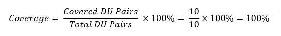

**Equation 1 - Range.combine method formula to calculate coverage**

**Equation 2 - DataUtilities.calculateColumnTotal method formula to calculate coverage**

We can derive the covered and total DU pairs from Figures 1-8 within the appendix. 

# 3 A detailed description of the testing strategy for the new unit test

We first have observed the a3 source code and alongside the javadocs to see what we have covered so far from a2. We used the Eclemma plugin to quickly see the coverage statistics. We mainly checked for statement/line and branch coverage. Then, based on that, we added new test cases to see which areas of methods were not covered in a3. Since a3 this time had the source code we were able to see which functions or branches had to be covered.

Since Range black box testing was extensively done in the previous assignment we had already a good level of coverage and therefore only added a few new coverages. 

# 4 A high level description of five selected test cases you have designed using coverage information, and how they have increased code coverage

We can compare the results from assignment 2 (figures 13-16, appendix) with the results of assignment 3 (figures 9-12, section 5). We can see increases in statement coverage upwards of 94% with regards to the calculateRowTotal, clone, and equal methods (figures 9, 15). Furthermore, we see an increase in statement coverage average for the DataUtilities test suite. Specifically, an increase of 46.8%. DataUtilities also saw a large increase in branch coverage with regards to the clone and equal methods as well, seeing an increase of 75.0% and 91.7% respectfully. 

For the methods in Range, we saw notable improvements in statement coverage regarding the toString and intersects methods, pushing 100% improvements (figures 11, 13). For branch coverage however, we saw no improvements with regards to these methods. Slight improvements of approximately 10% were seen in the equals and contains methods (figures 12, 14).

# 5 A detailed report of the coverage achieved of each class and method (a screen shot from the code cover results in green and red color would suffice)

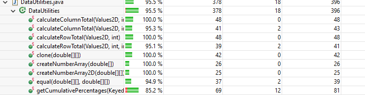

**Figure 9 - Statement coverage for DataUtilities.calculateColumnTotal method**

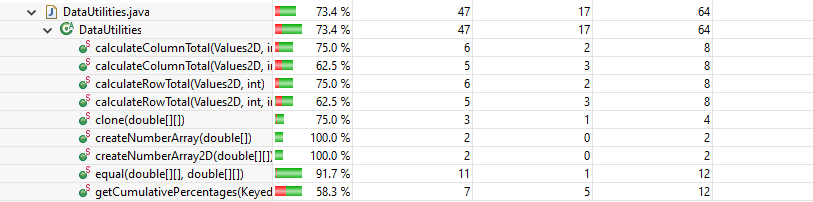

**Figure 10 - Branch coverage for DataUtilities.calculateColumnTotal method**

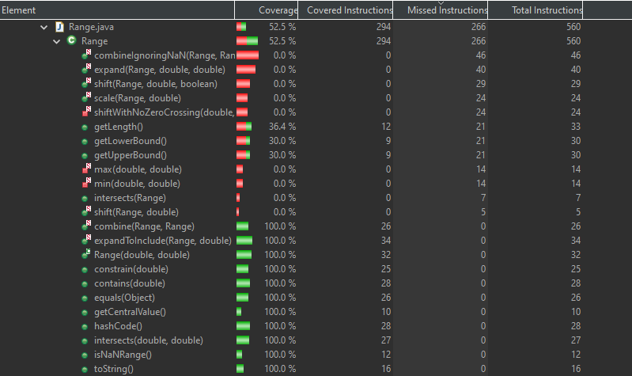

**Figure 11 - Statement coverage for Range.combine method**

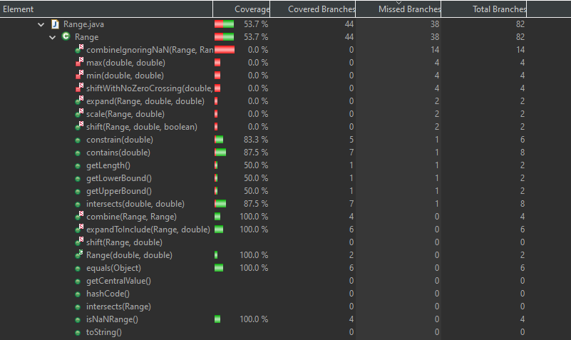

**Figure 12 - Branch coverage for Range.combine method**

# 6 Pros and Cons of coverage tools used and Metrics you report

We used the Eclemma plugin from Eclipse. The pros of this tool are that it is widely popular and the installation process is very simple and straightforward, taking less than a minute. Also it allowed us to see easily and accurately the coverage, as well switching between line and branch coverage. With just a few clicks we were quickly able to view the statistics and as well the highlighted green or red areas of codes that were covered or uncovered.
However, one major drawback is that the plugin does not provide a conditional coverage metric, which might have been essential for our assignment task.

# 7 A comparison on the advantages and disadvantages of requirements-based test generation and coverage-based test generation.

The advantages and disadvantages of each form of test generation can be derived simply from their names. Specifically, requirements-based tests are generated from the functional requirements listed for the software in question. It allows a test engineer to create tests that will verify whether a program can meet these requirements. The main disadvantage with this is requirements-based test generation often lacks scope. Even if all of the requirements-based tests pass, buggy code may remain within the program. Coverage-based test generation flips the idea of requirements-based tests, as it’s key advantage is being able to provide thorough coverage of every method within the program. By doing this, a test engineer is able to identify any code that isn’t used as a part of the full execution of the program. Since a test engineer refers to the code rather than a list of specifications for coverage-based test generation, it is possible to create tests that may not capture the purpose of a particular method within the program. This is the key disadvantage of coverage-based tests, as a function can pass a coverage-based test without addressing the bugs that would arise from the specific requirements of a given function. Consequently, any changes to the code would require changes to the test, leaving additional maintenance for the test engineer. 

# 8 A discussion on how the team work/effort was divided and managed

As a team of 4 members, we split up into 2 pairs: pair1(Abdul and Akashdeep) and pair2(Xian and Cale). Pair1 tested for Range whereas Pair2 tested for DataUtilities.
Each pair tested their respective program in a Pair programming style, where by taking turns one would code and the other guides or corrects in the process.
This allowed us to maintain an Agile workflow and complete the assignment in a tight timeline. Abdul and Xian have taken more responsibility in writing the testing code and they later compared the test cases between each other, once they were done coding. To allow the contributions to be fair therefore, Cale and Akashdeep partnered up on writing the report and added all calculations for the coverage.

# 9 Any difficulties encountered, challenges overcome, and lessons learned from performing the lab

One initial trouble we encountered was setting up the project. We were quite unsure whether the jar files and the mock jars as well had to be imported from assignment 2 or 3, as they were both present. However, by trial and error we were able to set up the imports properly as they were essential for running the Junit tests that had dependencies on these jar files.

Another problem was the fact that, since initially pair1 and pair2 were independently doing their assigned tasks we encountered a slight issue in importing and merging the test cases together. There was a slight build conflict when performing the action of Junit coverage test on the whole project. However, the conflict had been resolved without any complications.

# 10 Comments/feedback on the lab itself

Compared to the previous assignment, this 3rd assignment’s specification had a reasonable amount of text to read and comprehend the required task. This allowed us to quickly get started without having to read a lot.
Possibly the only very slight concern was setting up the project, we initially had the doubt on where to import the jar dependencies from, as mentioned before above. We believe providing a quick GIF animation of project setup would have been more easier to follow through, compared to switching back and forth between textual instruction and trying to find specific buttons or selections. We think this would make it an easier process for both the editor and the reader.

Although, this assignment has been a smoother process compared to previous ones and we are highly satisfied with it. 

# Appendix

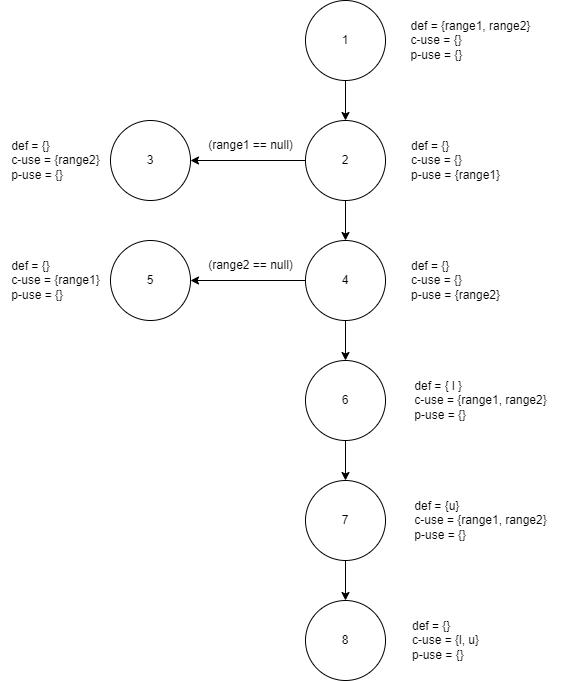

**Figure 1 - Data flow graph for Range.combine method**

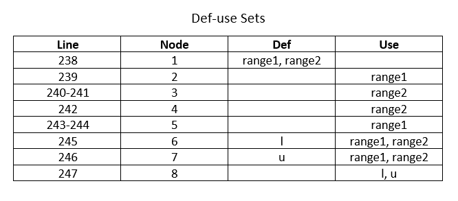

**Figure 2 - Def-use sets for Range.combine method**

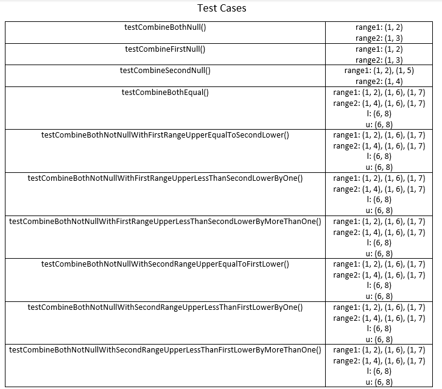

**Figure 3 - Test cases for Range.combine method**

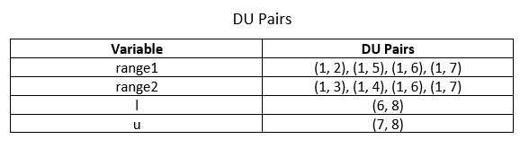

**Figure 4 - DU-pairs for Range.combine method**

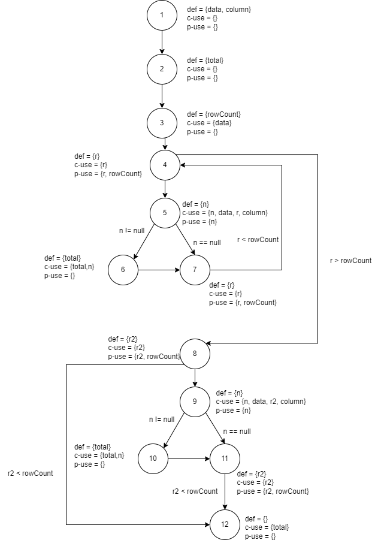

**Figure 5 - Data flow graph for DataUtilities.calculateColumnTotal method**

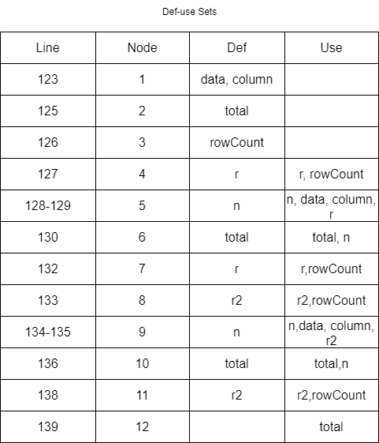

**Figure 6 - Def-use sets for DataUtilities.calculateColumnTotal method**

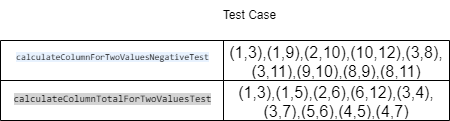

**Figure 7 - Test cases for DataUtilities.calculateColumnTotal method**

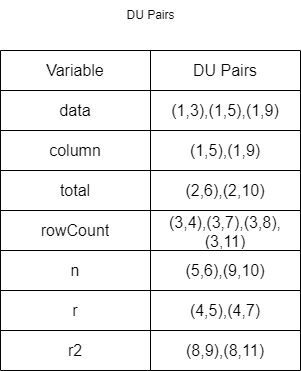

**Figure 8 - DU-pairs for DataUtilities.calculateColumnTotal method**

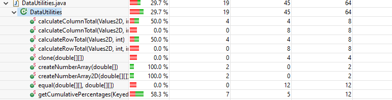

**Figure 13 - Statement coverage in assignment 2 for Range.combine method**

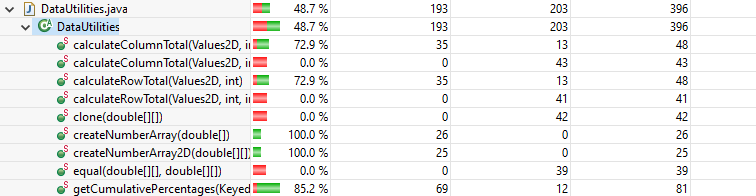

**Figure 14 - Branch coverage in assignment 2 for Range.combine method**

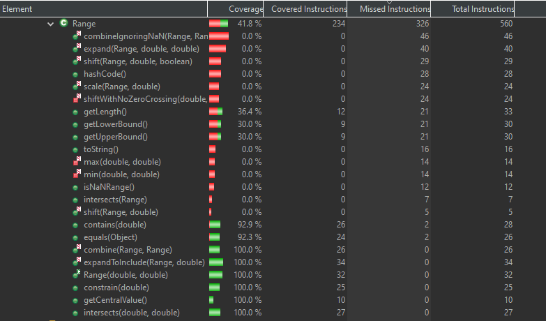

**Figure 15 - Statement coverage in assignment 2 calculateColumnTotal method**

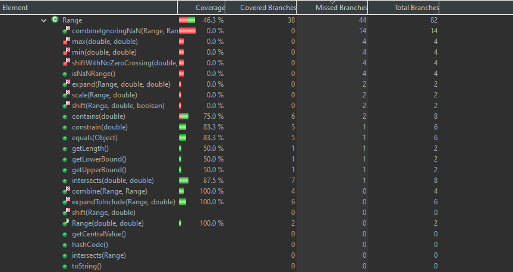

**Figure 16 - Branch coverage in assignment 2 calculateColumnTotal method**

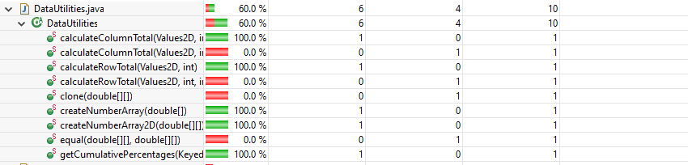

**Figure 17 - Method coverage in assignment 2 for datautils**

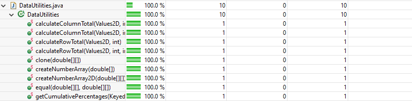

**Figure 18 - Method coverage in assignment 3 for datautils**

**Figure 19 - Method coverage in assignment 2 for range**

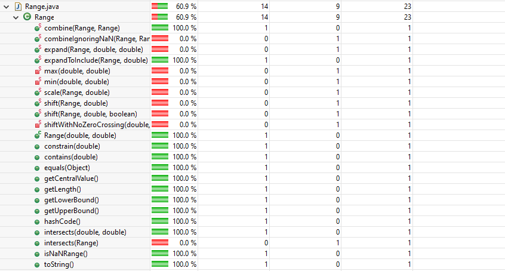

**Figure 20 - Method coverage in assignment 3 for range**
